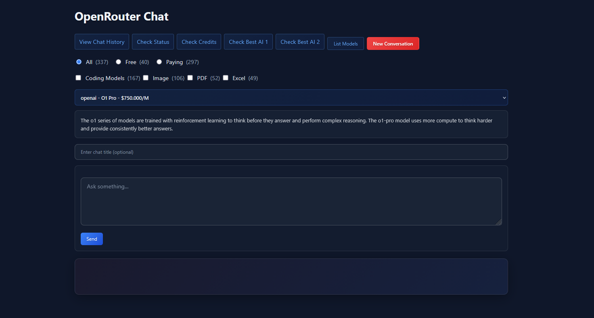

# Using the OpenRouter Chat Application

This page guides you through the OpenRouter Chat application interface, explaining how to interact with AI models and manage your conversations.

## Interface Overview

The application interface is designed to be intuitive and allow you to quickly start conversations with different AI models.

### Key Interface Elements

1.  **Main Navigation**
    *   **View Chat History**: Access the complete history of all your past conversations.
    *   **Check Status**: Check the current status of the OpenRouter.ai service (useful in case of issues).
    *   **Check Credits**: Check your credit balance on OpenRouter.ai.
    *   **Check Best AI 1 / Check Best AI 2**: Links to AI model rankings and comparisons to help you choose.
    *   **New Conversation**: Restarts the interface for a brand new conversation, clearing the current prompt and response.

2.  **Model Filters**
    These options allow you to filter the list of available models based on their status or capabilities.
    *   **All**: Displays all available models.
    *   **Free**: Displays only free models.
    *   **Paid**: Displays only paid models.
    *   **Coding Models (Checkbox)**: Check this box to specifically display models optimized for coding.

3.  **Model Selection**
    The dropdown menu `select id="model"` allows you to choose the AI model you want to interact with. Once a model is selected, a brief description (if available) will be displayed below.

4.  **Conversation Title (Optional)**
    `input type="text" id="chat-title"`: Before asking your first question, you can enter a title for your conversation. If this field is left empty, a title will be automatically generated from your first question. This title will be used to easily identify the conversation in your history.

5.  **Prompt Input Area**
    `textarea id="prompt"`: This is where you type your questions, commands, or instructions for the AI model.

6.  **"Send" Button**
    `button id="send-button"`: Click this button to send your prompt to the selected AI model and initiate or continue a conversation.

7.  **Response Area**
    `div class="response" id="response"`: The response generated by the AI model will be displayed in this area.

## Starting a New Conversation

1.  **Choose a Model**: Select the AI model you want to use from the dropdown menu. You can use the filters (All, Free, Paid, Coding Models) to refine your choice.
2.  **Give it a Title (Optional)**: Enter a descriptive title for your conversation in the "Enter chat title (optional)" field.
3.  **Write Your Prompt**: Enter your question or command in the text area provided for this purpose.
4.  **Send**: Click the "Send" button.

Your first question will start a new conversation. The model's response will appear in the response area.

## Continuing a Conversation

Once a conversation is started, each new prompt you send via the text area and the "Send" button will be added to the same conversation. The model will have access to the complete history of this conversation to contextualize its responses.

## Managing Conversations

*   **New Conversation**: If you want to start a conversation unrelated to the previous one, click the "New Conversation" button. This will clear the current interface and allow you to start from scratch.
*   **Chat History**: You can view all your past conversations by clicking "View Chat History". Each conversation will be listed with its title and you can access it to review the exchanges.